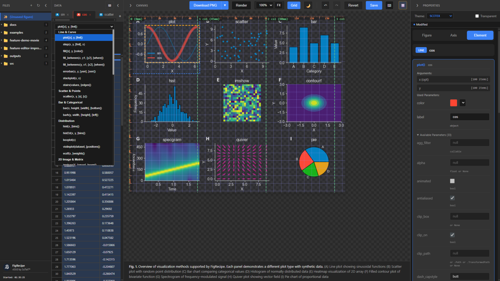
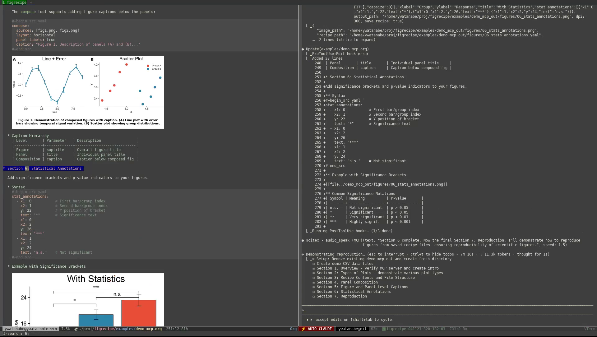
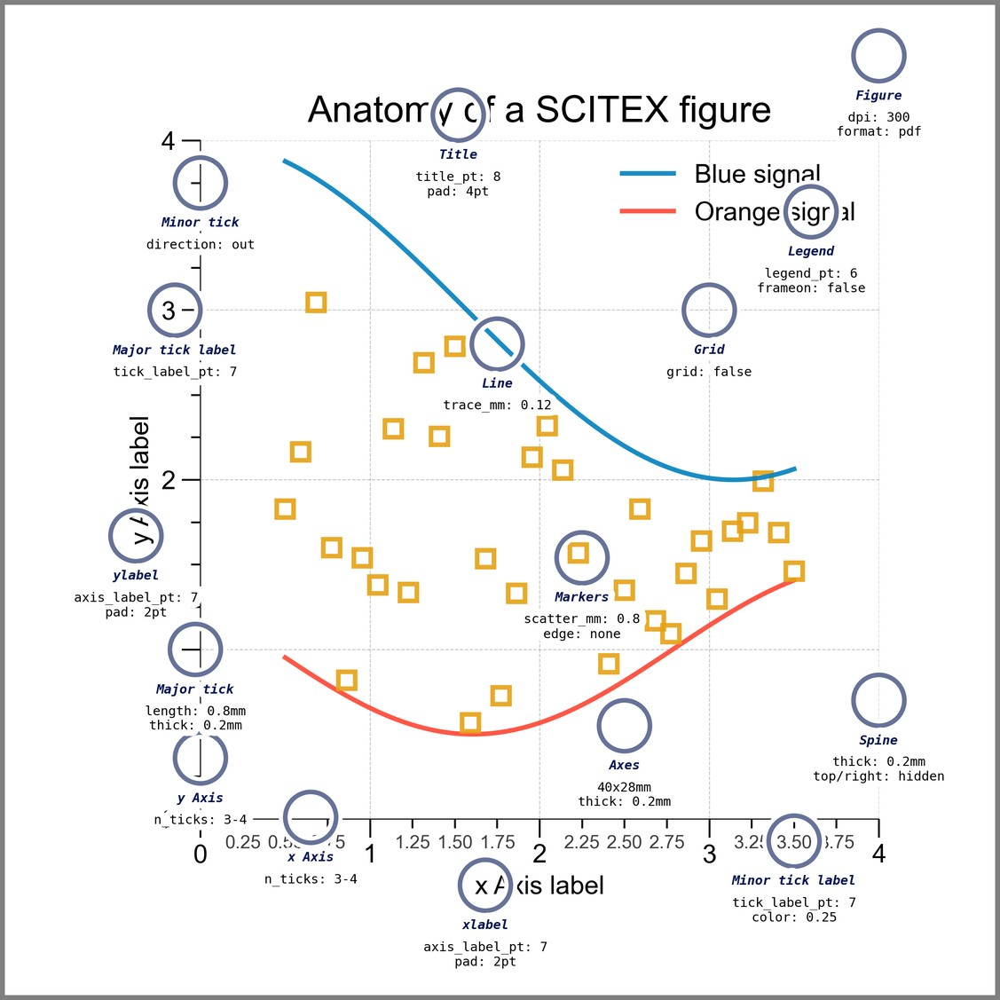
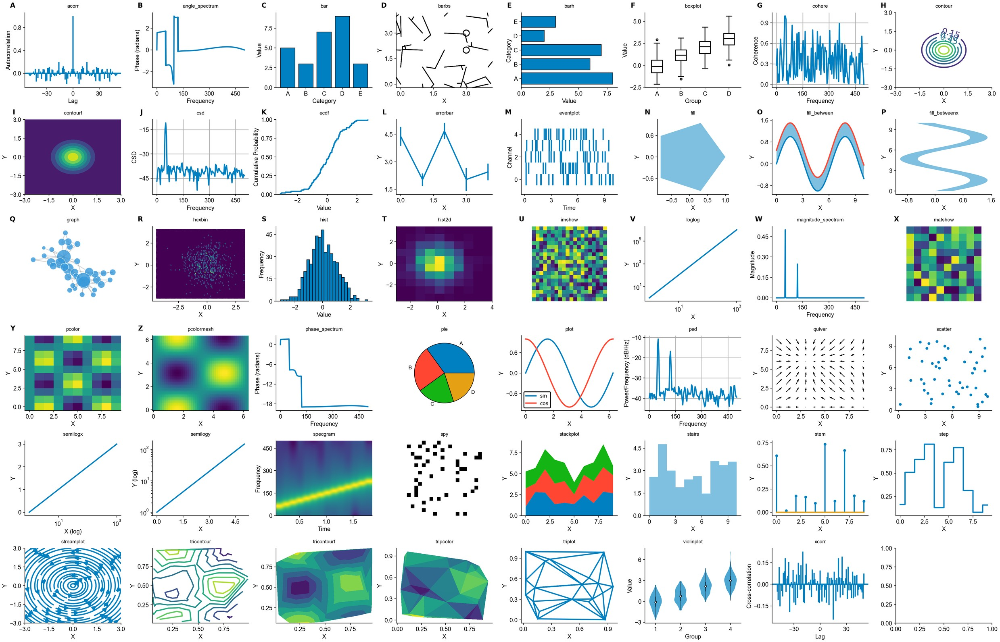

<!-- ---
!-- Timestamp: 2026-01-16 07:15:25
!-- Author: ywatanabe
!-- File: /home/ywatanabe/proj/figrecipe/README.md
!-- --- -->

# FigRecipe

**Reproducible scientific figures as first-class objects**

[](https://badge.fury.io/py/figrecipe)
[](https://github.com/ywatanabe1989/figrecipe/actions/workflows/test.yml)
[](https://www.gnu.org/licenses/agpl-3.0)

FigRecipe is a framework for creating **reproducible, editable, and publication-ready** scientific figures.

Instead of treating figures as static images, FigRecipe treats them as **structured objects** — with explicit data, layout, and style — that can be reproduced, edited, and shared.

Part of [**SciTeX™**](https://scitex.ai).

<p align="center">
  
</p>

### 🤖 MCP Server — AI Agents Can Create Figures

FigRecipe includes an **MCP (Model Context Protocol) server**, enabling AI agents like Claude to create, compose, and reproduce publication-ready figures autonomously.

📄 **[Full MCP Demo (PDF)](examples/demo_mcp_out/figrecipe-v0.14.0-demo.pdf)**

[](https://scitex.ai/media/videos/figrecipe-v0.14.0-demo.mp4)
▶️ *Click to watch video demo*

```bash
# Add to your Claude Code MCP config
figrecipe mcp install
```

## Why FigRecipe?

Most scientific figures are created by code, but cannot be reproduced once the code is lost or modified.

FigRecipe solves this by separating:
- **What** is plotted (data & semantics)
- **How** it is styled (layout, colors, typography)
- **How** it is edited (GUI or code)

This makes figures: **reproducible** · **inspectable** · **editable after publication**

## Quick Start

```bash
pip install figrecipe
```

```python
import figrecipe as fr
import numpy as np

fig, ax = fr.subplots()
ax.plot(np.sin(np.linspace(0, 10, 100)), id="sine")

fr.save(fig, "figure.png")  # → figure.png + figure.yaml
```

Reopen and edit later:

```python
fig, ax = fr.load("figure.png")
fr.edit(fig)  # Launch GUI editor
```

CLI:

```bash
figrecipe edit figure.png      # Launch GUI editor
figrecipe reproduce fig.yaml   # Recreate figure
figrecipe extract fig.yaml     # Extract plotted data
```

## What Makes FigRecipe Different?

**🔹 Figures are first-class objects** — Figures are not just images — they are structured, versionable artifacts.

**🔹 Declarative, not imperative** — You describe what the figure is, not just how to draw it.

**🔹 GUI + Code coexist** — The GUI is a frontend, not a black box. Everything is backed by a reproducible spec.

**🔹 Millimeter-precise layout** — Designed for journal figures, not dashboards.

**🔹 MCP Server for AI agents** — Let Claude and other AI agents create publication-ready figures autonomously.

<details>
<summary><b>Core Features</b></summary>

- Drop-in replacement for `matplotlib.pyplot`
- Fully reproducible figure recipes (`.yaml`)
- Publication-ready millimeter layout
- Interactive GUI editor
- Dark / light themes
- Works with existing matplotlib code
</details>

<details>
<summary><b>Save / Load Formats</b></summary>

```python
fr.save(fig, "fig.png")     # fig.png + fig.yaml
fr.save(fig, "bundle/")     # directory bundle
fr.save(fig, "fig.zip")     # zip bundle

fr.load("fig.png")
fr.load("bundle/")
fr.load("fig.zip")
```

| Format | Save | Load |
|--------|:----:|:----:|
| PNG / PDF / SVG | ✓ | ✓ |
| YAML | ✓ | ✓ |
| Directory / ZIP | ✓ | ✓ |
</details>

<details>
<summary><b>Style Presets</b></summary>

```python
fr.list_presets()
fr.load_style("SCITEX")
fr.load_style("SCITEX_DARK")
```
</details>

<details>
<summary><b>Millimeter-based Layout</b></summary>

```python
fig, ax = fr.subplots(
    axes_width_mm=60,
    axes_height_mm=40,
    margin_left_mm=15,
)
```
</details>

<details>
<summary><b>Figure Captions</b></summary>

```python
fig.set_caption("Main figure description")
ax.set_caption("Panel A description")
```
</details>

## Who Is This For?

FigRecipe is designed for researchers who:
- already use matplotlib or seaborn
- care about reproducibility and traceability
- want figures that survive revisions and collaboration
- are tired of re-writing plotting code

It is not meant to replace exploratory notebooks or quick plotting — it is meant to **formalize results**.

## Style Granularity

FigRecipe provides **millimeter-precise control** over every visual element with the SCITEX style preset:

<p align="center">
  
</p>

Includes **statistical annotation brackets** with significance stars (*, **, ***) for publication-ready comparisons.

## Plot Gallery

FigRecipe supports **47 matplotlib plot types** with publication-ready SCITEX styling:

<p align="center">
  
</p>

<details>
<summary><b>Supported Plot Types</b></summary>

**Line & Curve**: plot, step, fill, fill_between, fill_betweenx, errorbar, stackplot, stairs

**Scatter & Points**: scatter

**Bar & Categorical**: bar, barh

**Distribution**: hist, hist2d, boxplot, violinplot, ecdf

**2D Image & Matrix**: imshow, matshow, pcolor, pcolormesh, hexbin, spy

**Contour & Surface**: contour, contourf, tricontour, tricontourf, tripcolor, triplot

**Spectral & Signal**: specgram, psd, csd, cohere, angle_spectrum, magnitude_spectrum, phase_spectrum, acorr, xcorr

**Vector & Flow**: quiver, barbs, streamplot

**Special**: pie, stem, eventplot, loglog, semilogx, semilogy, graph

</details>

## Philosophy

> *A scientific figure is not an image. It is a structured representation of knowledge.*

FigRecipe treats figures as **first-class scientific objects**.

---

<p align="center">
  <a href="https://scitex.ai" target="_blank"></a>
  <br>
  AGPL-3.0 · ywatanabe@scitex.ai
</p>

<!-- EOF -->
