<!-- ---
!-- Timestamp: 2025-12-27 02:15:07
!-- Author: ywatanabe
!-- File: /home/ywatanabe/proj/figrecipe/README.md
!-- --- -->

<p align="center">
  <a href="https://scitex.ai" target="_blank">
    
  </a>
</p>

# FigRecipe — **Reproducible matplotlib figures with mm-precision layouts.**

FigRecipe separates **what** is plotted (data) from **how** it is styled, storing both in a structured format. This enables reproducible figures with GUI editing while preserving scientific integrity, and allows AI integration in a scientifically rigorous manner. Ultimately, FigRecipe will bundle: (1) reproducible, style-editable figures, and (2) metadata such as statistical values—creating atomic, portable, and traceable scientific figure objects essential for automated research in the AI era.

FigRecipe is part of [**SciTeX™ (pending) – Research OS for reproducible science**](https://scitex.ai)

[](https://badge.fury.io/py/figrecipe)
[](https://github.com/ywatanabe1989/figrecipe/actions/workflows/test.yml)
[](https://www.gnu.org/licenses/agpl-3.0)


---

## Key Features

- ✅ Drop-in replacement for `matplotlib.pyplot`—minimal migration and learning cost
- ✅ All intermediate files use familiar formats (PNG/SVG/PDF/YAML/JSON)
- ✅ Import/Export to integrate with your existing workflow
- ✅ Millimeter-based layout (journal-ready)—difficult to achieve manually with matplotlib
- ✅ Publication-quality style presets
- ✅ Dark theme support (data colors preserved), with light theme export for journal compliance
- ✅ Research-focused features: automatic cropping, axis alignment, panel labels, and caption embedding
- ✅ Interactive GUI editor for manual adjustments

---

## Examples

📓 **[View Demo Notebook on nbviewer](https://nbviewer.org/github/ywatanabe1989/figrecipe/blob/main/examples/figrecipe_demo.ipynb)** (recommended)

<details>
<summary><b>Demo Videos</b> — GUI Editor in action</summary>

| Dark Mode | Change Color | Drag Panel |
|:---:|:---:|:---:|
|  |  |  |

| Move Legend | Undo/Redo | Toggle Theme |
|:---:|:---:|:---:|
|  |  |  |

| Hover Feedback | Edit Labels | Zoom Controls |
|:---:|:---:|:---:|
|  |  |  |

</details>

<details>
<summary><b>Supported Plot Types</b> — 46 matplotlib plot types in 9 categories</summary>

<p align="center">
  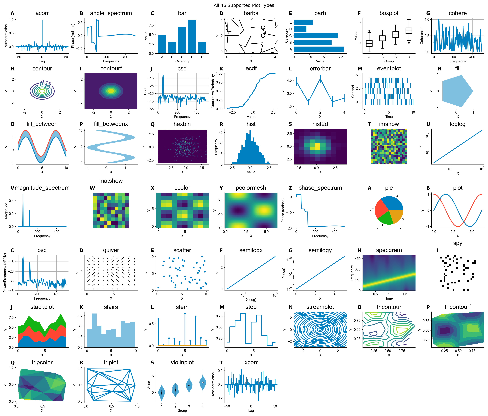
</p>

| Line & Curve | Scatter | Distribution |
|:---:|:---:|:---:|
| 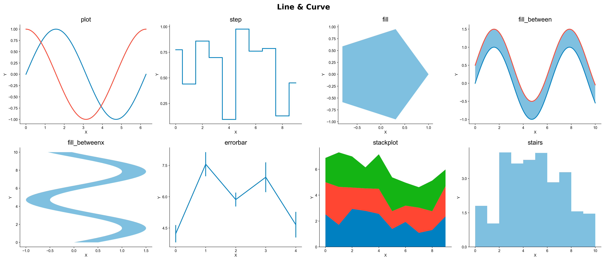 | 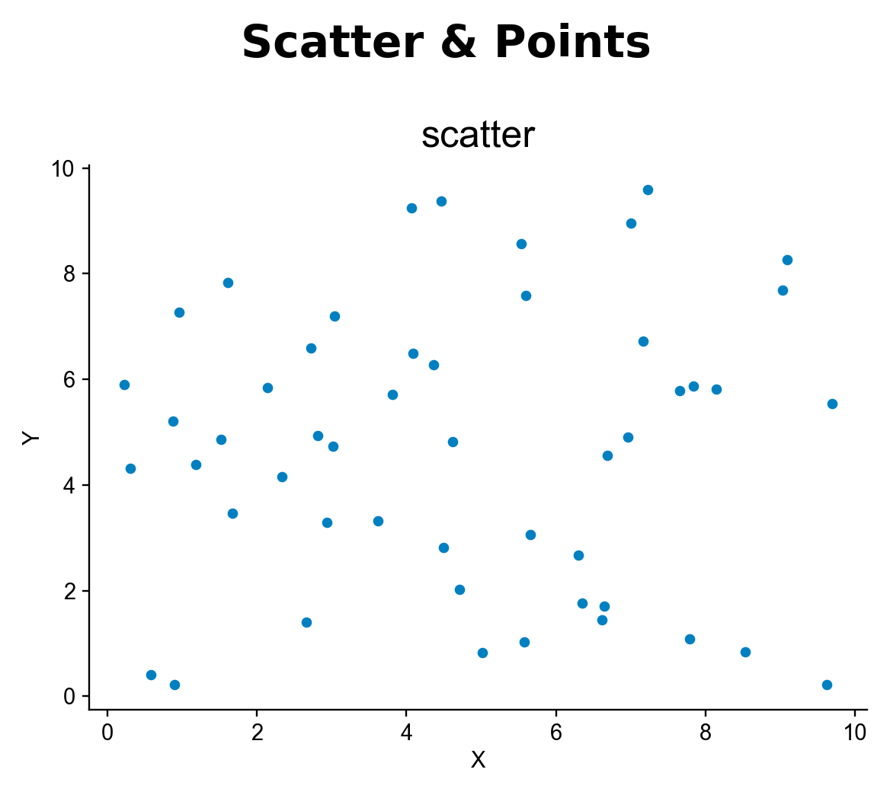 | 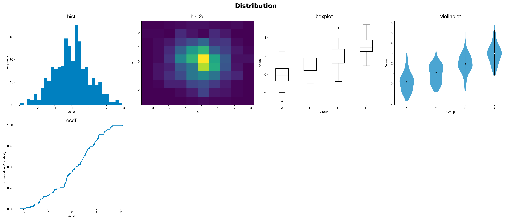 |

| Bar & Categorical | Contour & Surface | 2D/Image/Matrix |
|:---:|:---:|:---:|
| 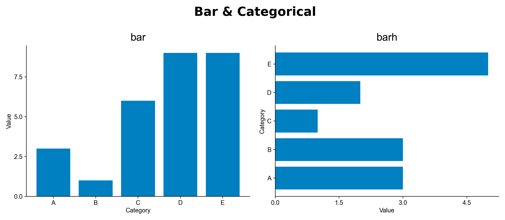 | 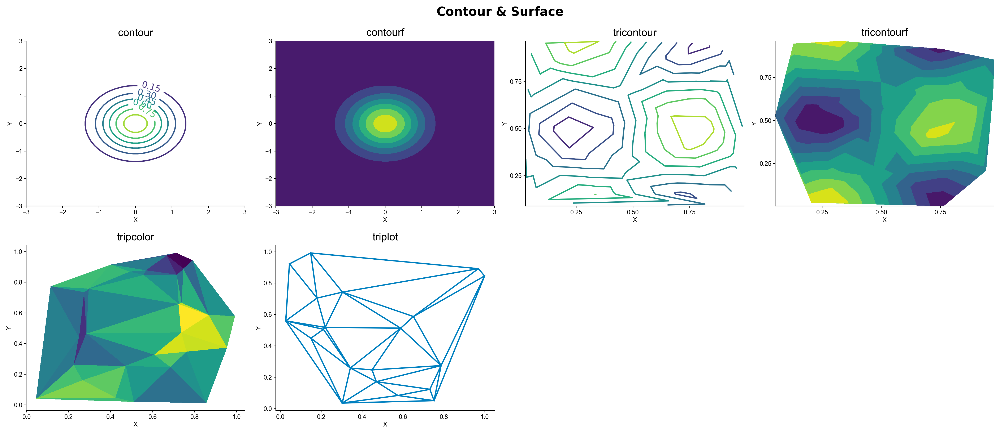 | 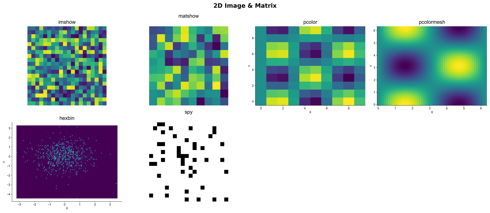 |

| Vector & Flow | Spectral & Signal | Special |
|:---:|:---:|:---:|
| 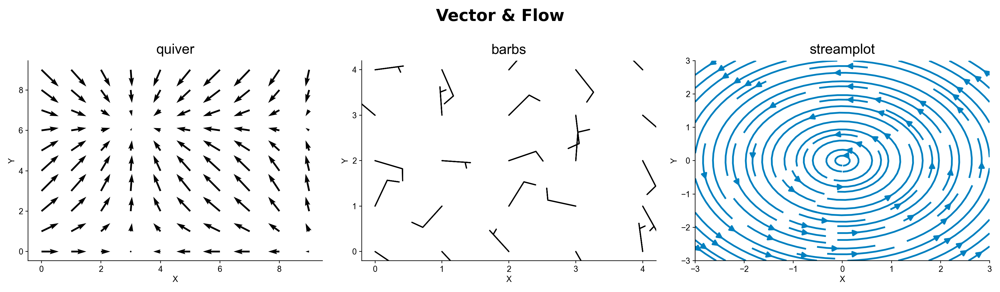 | 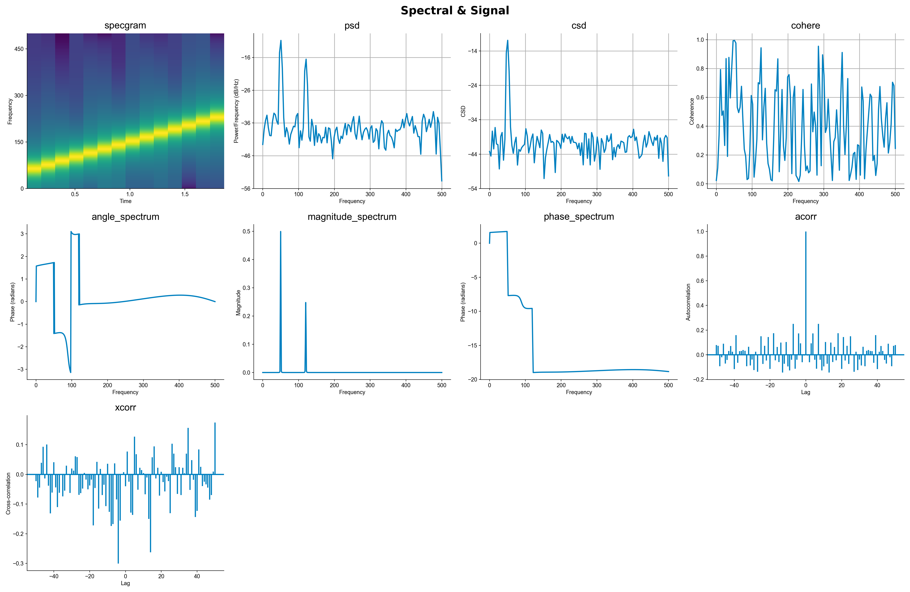 |  |

Generate all plots: `python examples/demo_plot_all.py`
</details>

## Installation

```bash
pip install figrecipe

# Optional extras
pip install figrecipe[seaborn]   # seaborn + pandas support
pip install figrecipe[imaging]   # image cropping (Pillow)
pip install figrecipe[all]       # all extras

# Optional: for PDF export from notebooks (SVG → PDF)
sudo apt install inkscape  # Linux
brew install inkscape      # macOS
```

**Requirements:** Python >= 3.9

## Basic Usage

### Recording & Saving

``` python
import figrecipe as fr
# import figrecipe.pyplot as plt
import numpy as np

x = np.linspace(0, 10, 100)
y = np.sin(x)

fig, ax = fr.subplots() # or plt.subplots()
ax.plot(x, y, color='red', linewidth=2, id='sine_wave')
ax.set_xlabel('Time (s)')
ax.set_ylabel('Amplitude')

# Save image + recipe
img_path, yaml_path, result = fr.save(fig, 'figure.png')
# → creates: figure.png + figure.yaml
```

### Reproducing a Figure

``` python
import figrecipe as fr

fig, ax = fr.reproduce('figure.yaml')
```

### Extracting Plotted Data

``` python
import figrecipe as fr

data = fr.extract_data('figure.yaml')
# {'sine_wave': {'x': array([...]), 'y': array([...])}}
```

### Style Presets

``` python
fr.list_presets()
# ['MATPLOTLIB', 'SCITEX']

# Publication-quality preset (applied globally)
fr.load_style('SCITEX')
fig, ax = fr.subplots()

# Dark theme (UI-only, data colors preserved)
fr.load_style('SCITEX_DARK')
# or: fr.load_style('SCITEX', dark=True)

# Custom style
fr.load_style('/path/to/my_style.yaml')
```

See [src/figrecipe/styles/presets/](src/figrecipe/styles/presets/) for full examples.

### Millimeter-Based Layout (Publication-Ready)

``` python
fig, ax = fr.subplots(
    axes_width_mm=60,
    axes_height_mm=40,
    margin_left_mm=15,
    margin_bottom_mm=12,
)
```
This guarantees consistent sizing across editors, exports, and journals.

### Interactive GUI Editor

``` python
import figrecipe as fr
import numpy as np

fig, ax = fr.subplots()
ax.plot(np.sin(np.linspace(0, 10, 100)))

# Launch browser-based editor
overrides = fr.edit(fig, port=5050)

# Returns style overrides when editor is closed (Ctrl+C)
# Apply overrides to future figures or save to custom YAML
```

<p align="center">
  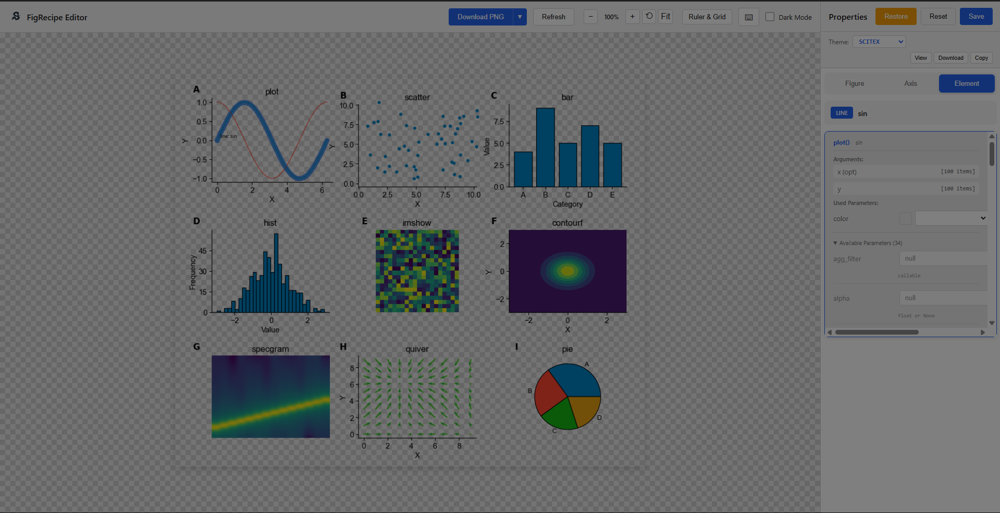
</p>

The editor provides:
- **Live preview** with real-time style updates
- **Theme switching** between SCITEX/MATPLOTLIB presets
- **Element selection** with hover highlighting
- **Property panels** for Figure, Axis, Legend, and Labels
- **Download** in PNG, SVG, PDF formats
- **Export** updated recipe YAML

| Axis Properties | Download Options | Dark Mode |
|:---:|:---:|:---:|
| 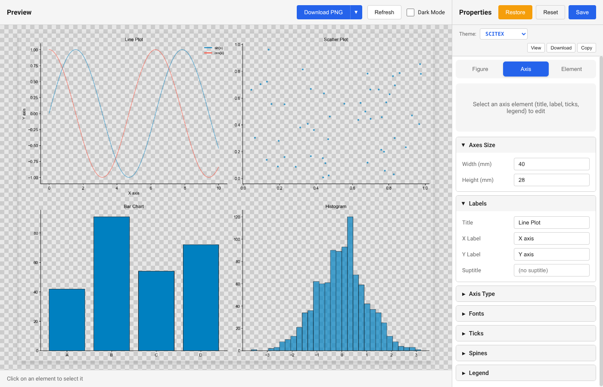 |  | 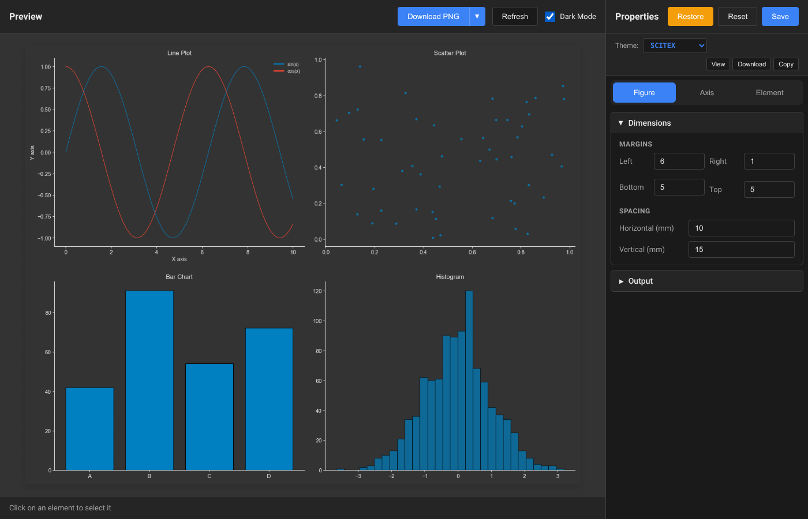 |

<details>
<summary><b>Style Format (YAML)</b> — Full preset example</summary>

``` yaml
# FIGRECIPE Style Preset (SCITEX)
axes:
  width_mm: 40
  height_mm: 28
  thickness_mm: 0.2

margins:
  left_mm: 1
  right_mm: 1
  bottom_mm: 1
  top_mm: 1

fonts:
  family: "Arial"
  axis_label_pt: 7
  tick_label_pt: 7
  title_pt: 8

lines:
  trace_mm: 0.2
  errorbar_mm: 0.2

ticks:
  length_mm: 0.8
  thickness_mm: 0.2
  direction: "out"

output:
  dpi: 300
  transparent: true
  format: "pdf"

theme:
  mode: "light"
  dark:
    text: "#d4d4d4"
    spine: "#d4d4d4"
  light:
    text: "black"
    spine: "black"

colors:
  palette:
    - [0, 128, 192]      # blue
    - [255, 70, 50]      # red
    - [20, 180, 20]      # green
# EOF
```

See [src/figrecipe/styles/presets/](src/figrecipe/styles/presets/) for complete examples.
</details>


### API Overview

| Import                           | Description                                       |
|----------------------------------|---------------------------------------------------|
| `import figrecipe.pyplot as plt` | Drop-in replacement of `matplotlib.pyplot as plt` |
| `import figrecipe as fr`         | Import figrecipe package                          |

| Function                         |                                                   |
|----------------------------------|---------------------------------------------------|
| `fr.subplots()`                  | Create a recording-enabled figure                 |
| `fr.save(fig, 'fig.png')`        | Save image + recipe                               |
| `fr.reproduce('fig.yaml')`       | Reproduce figure from recipe                      |
| `fr.extract_data('fig.yaml')`    | Extract plotted data                              |
| `fr.info('fig.yaml')`            | Inspect recipe metadata                           |
| `fr.edit(fig)`                   | Launch interactive GUI editor                     |
| `fr.load_style()`                | Load style preset (global)                        |
| `fr.list_presets()`              | List available presets                            |
| `fr.crop('fig.png')`             | Crop to content with mm margin                    |


## License

AGPL-3.0 See [LICENSE](LICENSE)

## Contact
Yusuke Watanabe (ywatanabe@scitex.ai)

<p align="center">
  <a href="https://scitex.ai" target="_blank">
    
  </a>
</p>

<!-- EOF -->
