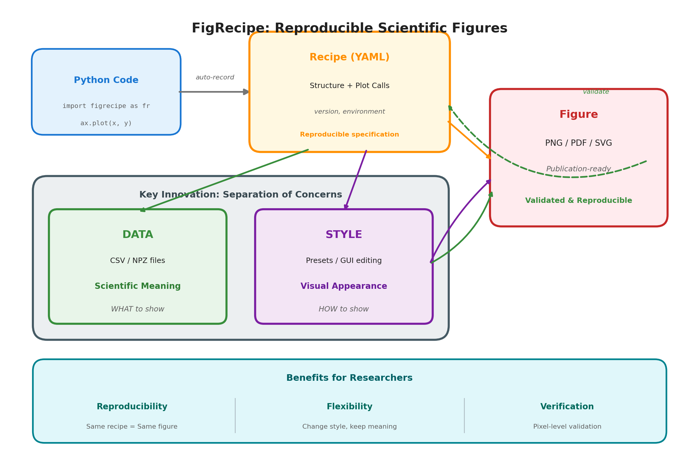
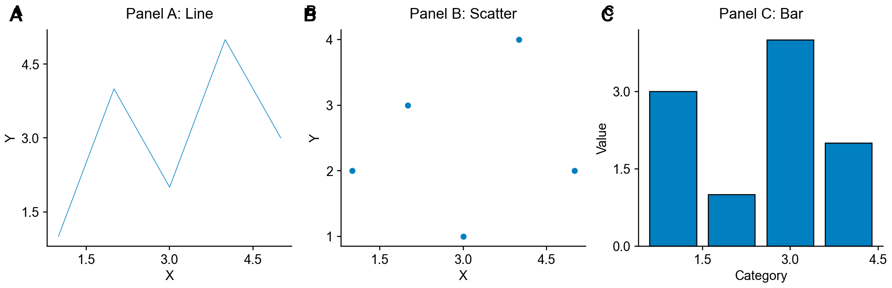

<!-- ---
!-- Timestamp: 2026-02-07 10:43:01
!-- Author: ywatanabe
!-- File: /home/ywatanabe/proj/figrecipe/README.md
!-- --- -->

# FigRecipe (<code>scitex-plt</code>)

<p align="center">
  <a href="https://scitex.ai">
    
  </a>
</p>

<p align="center"><b>Reproducible scientific figures as first-class objects</b></p>

<p align="center">
  <a href="https://badge.fury.io/py/figrecipe"></a>
  <a href="https://figrecipe.readthedocs.io/"></a>
  <a href="https://github.com/ywatanabe1989/figrecipe/actions/workflows/test.yml"></a>
  <a href="https://www.gnu.org/licenses/agpl-3.0"></a>
</p>

<p align="center">
  <a href="https://figrecipe.readthedocs.io/">Full Documentation</a> · <code>pip install figrecipe</code>
</p>

---

**Reproducible, editable, publication-ready scientific figures.** Part of [**SciTeX**](https://scitex.ai).

> **SciTeX users**: `pip install scitex[plt]` includes FigRecipe. `scitex.plt` delegates to `figrecipe` — they share the same API.

## Overview

FigRecipe treats recipe, data, and style as first-class attributes of every figure. This enables data governance and style editing without losing scientific rigor.

<p align="center">
  
</p>

## Styling

FigRecipe provides **millimeter-precise control** over every visual element. The SCITEX style preset is applied by default, producing publication-ready figures with standard matplotlib plotting.

<p align="center">
  
</p>

<details>
<summary><b>Millimeter-based Layout</b></summary>

```python
fig, ax = fr.subplots(
    axes_width_mm=60,
    axes_height_mm=40,
    margin_left_mm=15,
)
```

</details>

<details>
<summary><b>Style Presets</b></summary>

```python
fr.load_style("SCITEX")       # Publication defaults
fr.load_style("SCITEX_DARK")  # Dark theme
fr.load_style("MATPLOTLIB")   # Pure Matplotlib
```

</details>

## GUI Editor

For precise adjustments, GUI editor is available.

<p align="center">
  
</p>

## Migration from Matplotlib

#### Matplotlib-compatibility

<details>

FigRecipe is a **drop-in replacement** for matplotlib — just change your import:

```python
# Before
import matplotlib.pyplot as plt
fig, ax = plt.subplots()
ax.plot(x, y)
plt.savefig("fig.png")

# After
import figrecipe as fr
fig, ax = fr.subplots()
ax.plot(x, y, id="my_trace")
fr.save(fig, "fig.png")  # → fig.png + fig.yaml + fig_data/
```

#### Systematic Migration

[`scitex-linter`](https://github.com/ywatanabe1989/scitex-linter) detects and auto-fixes matplotlib patterns into mm-based FigRecipe equivalents (`check`, `format`, `python`). It also works as a pre-commit hook, ensuring AI agents follow FigRecipe conventions.

</details>

## Schematic Diagrams

<details>

Create publication-quality box-and-arrow schematics with mm-based coordinates:

```python
s = fr.Schematic(title="EEG Analysis Pipeline", width_mm=350, height_mm=100)
s.add_box("raw", "Raw EEG", subtitle="64 ch", emphasis="muted")
s.add_box("filter", "Bandpass Filter", subtitle="0.5-45 Hz", emphasis="primary")
s.add_box("ica", "ICA", subtitle="Artifact removal", emphasis="primary")
s.add_arrow("raw", "filter")
s.add_arrow("filter", "ica")
s.auto_layout(layout="lr", gap_mm=15)

fig, ax = fr.subplots()
ax.schematic(s, id="pipeline")
fr.save(fig, "pipeline.png")
```

<p align="center">
  
</p>

</details>

## Three Interfaces

<details>
<summary><strong>🐍 Python API</strong></summary>

<br>

**Create and save** — standard matplotlib API with auto-recording:

```python
import figrecipe as fr
import numpy as np

fig, ax = fr.subplots()
ax.plot(np.sin(np.linspace(0, 10, 100)), id="sine")
fr.save(fig, "figure.png")  # Saves + validates pixel-identical reproduction
```

**Output**:
```
figure.png                # Publication-ready image
figure.yaml               # Reproducible recipe (validated on save)
figure_data/
  sine.csv                # Plot data (one CSV per trace)
```

**Save / Load Formats** — from recipe or bundle:

```python
fr.save(fig, "fig.png")     # fig.png + fig.yaml
fr.save(fig, "fig.zip")     # self-contained zip bundle
fr.load("fig.png")          # reload from any format
```

| Format | Save | Load |
|--------|:----:|:----:|
| PNG / PDF / SVG | ✓ | ✓ |
| YAML | ✓ | ✓ |
| Directory / ZIP | ✓ | ✓ |


**Reproduce and edit** — from recipe or bundle:

```python
fig, ax = fr.reproduce("figure.yaml")
fr.gui(fig)  # Launch visual editor (at http://127.0.0.1:5050 by default)
```

**Compose** — multi-panel figures:

```python
fr.compose(
    sources=["panel_a.yaml", "panel_b.yaml"],
    output_path="composed.png",
    layout="horizontal",
)
```

<p align="center">
  
</p>

**Statistics** — significance brackets:

```python
ax.add_stat_annotation(x1=0, x2=1, p_value=0.01, style="stars")
```

> **[Full API reference](https://figrecipe.readthedocs.io/en/latest/)**

</details>

<details>
<summary><strong>🖥️ CLI Commands</strong></summary>

<br>

```bash
figrecipe --help-recursive            # Show all commands
figrecipe reproduce fig.yaml          # Recreate figure from recipe
figrecipe gui figure.png              # Launch visual editor
figrecipe validate fig.yaml           # Verify pixel-identical reproduction
figrecipe extract fig.yaml            # Extract plotted data as CSV
figrecipe compose a.yaml b.yaml       # Compose multi-panel figure
figrecipe crop figure.png             # Auto-crop whitespace
figrecipe info fig.yaml               # Show recipe metadata
```

> **[Full CLI reference](https://figrecipe.readthedocs.io/en/latest/cli_reference.html)**

</details>

<details>
<summary><strong>🔧 MCP Server — for AI Agents</strong></summary>

<br>

AI agents can create, compose, and reproduce publication-ready figures autonomously.

| Tool | Description |
|------|-------------|
| `plot` | Create figure from declarative YAML spec |
| `reproduce` | Recreate figure from recipe |
| `compose` | Combine panels into multi-panel layout |
| `crop` | Auto-crop whitespace |
| `info` | Inspect recipe metadata |
| `validate` | Verify reproduction fidelity |

```bash
# Install to Claude Code
figrecipe mcp install
```

> **[Full MCP specification](https://figrecipe.readthedocs.io/en/latest/mcp_spec.html)**

</details>

## Supported Plot Types — **47 matplotlib plot types**

<details>

**Line & Curve**: plot, step, fill, fill_between, fill_betweenx, errorbar, stackplot, stairs

**Scatter & Points**: scatter

**Bar & Categorical**: bar, barh

**Distribution**: hist, hist2d, boxplot, violinplot, ecdf

**2D Image & Matrix**: imshow, matshow, pcolor, pcolormesh, hexbin, spy

**Contour & Surface**: contour, contourf, tricontour, tricontourf, tripcolor, triplot

**Spectral & Signal**: specgram, psd, csd, cohere, angle_spectrum, magnitude_spectrum, phase_spectrum, acorr, xcorr

**Vector & Flow**: quiver, barbs, streamplot

**Special**: pie, stem, eventplot, loglog, semilogx, semilogy, graph

</details>

---

<p align="center">
  <a href="https://scitex.ai" target="_blank"></a>
  <br>
  AGPL-3.0 · ywatanabe@scitex.ai
</p>

<!-- EOF -->
