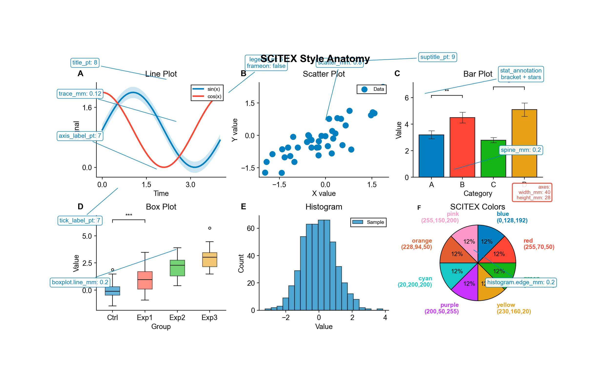
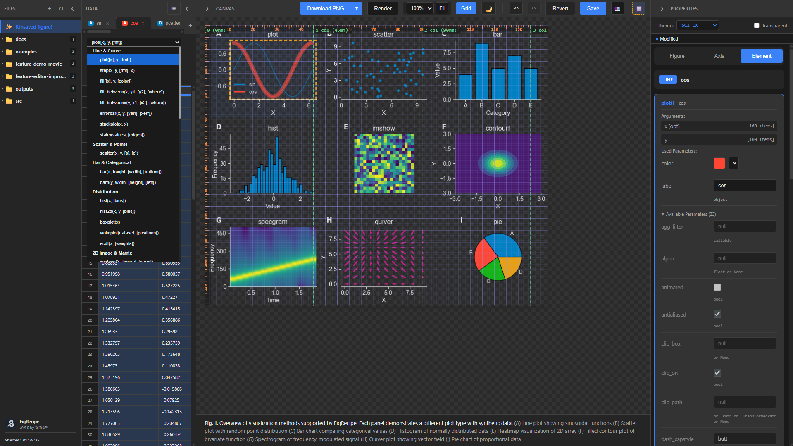

<!-- ---
!-- Timestamp: 2026-03-11 12:29:40
!-- Author: ywatanabe
!-- File: /home/ywatanabe/proj/figrecipe/README.md
!-- --- -->

# FigRecipe (<code>scitex-plt</code>)

<p align="center">
  <a href="https://scitex.ai">
    
  </a>
</p>

<p align="center"><b>Reproducible scientific figures as first-class objects</b></p>

<p align="center">
  <a href="https://badge.fury.io/py/figrecipe"></a>
  <a href="https://figrecipe.readthedocs.io/"></a>
  <a href="https://github.com/ywatanabe1989/figrecipe/actions/workflows/test.yml"></a>
  <a href="https://codecov.io/gh/ywatanabe1989/figrecipe"></a>
  <a href="https://www.gnu.org/licenses/agpl-3.0"></a>
</p>

<p align="center">
  <a href="https://figrecipe.readthedocs.io/">Full Documentation</a> · <code>pip install figrecipe</code>
</p>

---

## Problem and Solution


| # | Problem | Solution |
|---|---------|----------|
| 1 | **Figures drift from data** -- `plt.savefig(...)` produces a PNG whose source data disappears the moment the notebook closes | **Recipe + data + PNG atomic** -- each `ax.stx_*()` call records inputs; `stx.io.save(fig)` writes `.png + .csv + .yaml` so figures are replayable from the recipe |
| 2 | **Restyling requires re-running analysis** -- changing fonts/colors/layout means rebuilding the figure from scratch | **Reproduce from recipe** -- `stx.plt.reproduce("fig.yaml", style="nature")` restyles without touching data; hashes stay valid for Clew |
| 3 | **mm-precision layout hard** -- matplotlib uses inches/pixels; journals demand mm | **Native mm layout** -- `figure_mm()` + `figure_from_axes_mm()` give journal-grade column widths without conversion math |

## Installation

Requires Python >= 3.10.

```bash
pip install figrecipe
```

For the GUI editor: `pip install figrecipe[editor]`

## Part of SciTeX

figrecipe is part of [SciTeX](https://scitex.ai) — the umbrella `scitex` package re-exports it as `scitex.plt`. Both surfaces share the same API, so code written against `figrecipe` runs unchanged inside larger SciTeX pipelines.

## Quickstart

```python
import figrecipe as fr
import numpy as np

x = np.linspace(0, 2 * np.pi, 100)

fig, ax = fr.subplots()
ax.plot(x, np.sin(x), id="sine")
fr.save(fig, "figure.png")
# Produces: figure.png, figure.yaml, figure_data/sine.csv
```

Reload and edit from the saved recipe:

```python
fig, ax = fr.reproduce("figure.yaml")
fr.gui(fig)  # Launch visual editor at http://127.0.0.1:5050
```

---

## Role in SciTeX Ecosystem

FigRecipe is the **first app built on the SciTeX platform** -- it proves the app pattern that other apps follow. It works standalone (`figrecipe gui`) AND embedded inside scitex-cloud.

```
scitex (orchestrator) -- re-exports figrecipe as scitex.plt
  |-- scitex-app        -- runtime SDK (FigRecipe inherits ScitexAppConfig)
  |-- scitex-ui         -- React/TS components (FigRecipe consumes these)
  +-- figrecipe (this package) -- reference app
        |-- figrecipe           -- standalone Python package (pip install figrecipe)
        +-- figrecipe._django   -- Django integration for scitex-cloud embedding
```

**What this package owns:** Figure creation, reproduction, and composition engine; YAML recipe format and data provenance; Diagram system (box-and-arrow with mm-based coordinates); GUI editor; Django integration.

**What this package does NOT own:** App runtime SDK (inherits from [scitex-app](https://github.com/ywatanabe1989/scitex-app)); UI components (consumes from [scitex-ui](https://github.com/ywatanabe1989/scitex-ui)); Templates (managed by [scitex](https://github.com/ywatanabe1989/scitex-python)).

---

# FigRecipe -- **Reproducible, editable, publication-ready scientific figures.** Part of [**SciTeX**](https://scitex.ai).

The SciTeX system follows the Four Freedoms for Research below, inspired by [the Free Software Definition](https://www.gnu.org/philosophy/free-sw.en.html):

>Four Freedoms for Research
>
>0. The freedom to **run** your research anywhere -- your machine, your terms.
>1. The freedom to **study** how every step works -- from raw data to final manuscript.
>2. The freedom to **redistribute** your workflows, not just your papers.
>3. The freedom to **modify** any module and share improvements with the community.
>
>AGPL-3.0 -- because we believe research infrastructure deserves the same freedoms as the software it runs on.

## Overview

FigRecipe treats recipe, data, and style as first-class attributes of every figure. This enables data governance and style editing without losing scientific rigor.

<p align="center">
  
</p>

<p align="center"><sub>Created with <a href="#diagrams">Diagrams</a></sub></p>

## Styling

FigRecipe provides **millimeter-precise control** over every visual element. The SCITEX style preset is applied by default, producing publication-ready figures with standard matplotlib plotting.

<p align="center">
  
</p>

<details>
<summary><b>Millimeter-based Layout</b></summary>

```python
fig, ax = fr.subplots(axes_width_mm=60, axes_height_mm=40, margin_left_mm=15)
```

</details>

<details>
<summary><b>Style Presets</b></summary>

```python
fr.load_style("SCITEX")       # Publication defaults
fr.load_style("SCITEX_DARK")  # Dark theme
fr.load_style("MATPLOTLIB")   # Pure Matplotlib
```

</details>

## GUI Editor

For precise adjustments, GUI editor is available.

<p align="center">
  
</p>

## Migration from Matplotlib

#### Matplotlib-compatibility

<details>

FigRecipe is a **drop-in replacement** for matplotlib -- just change your import:

```python
# Before
import matplotlib.pyplot as plt
fig, ax = plt.subplots()
ax.plot(x, y)
plt.savefig("fig.png")

# After
import figrecipe as fr
fig, ax = fr.subplots()
ax.plot(x, y, id="my_trace")
fr.save(fig, "fig.png")  # -> fig.png + fig.yaml + fig_data/
```

#### Systematic Migration

[`scitex-linter`](https://github.com/ywatanabe1989/scitex-linter) detects and auto-fixes matplotlib patterns into mm-based FigRecipe equivalents (`check`, `format`, `python`). It also works as a pre-commit hook, ensuring AI agents follow FigRecipe conventions.

</details>

## Diagrams

Create publication-quality box-and-arrow diagrams with mm-based coordinates. See [Overview](#overview) for an example output.

<details>
<summary><strong>Usage</strong></summary>

<br>

```python
from figrecipe import Diagram

d = Diagram(title="EEG Pipeline", gap_mm=10)
d.add_box("raw", "Raw EEG", subtitle="64 ch", emphasis="muted", shape="cylinder")
d.add_box("filter", "Bandpass", subtitle="0.5-45 Hz", emphasis="primary")
d.add_box("ica", "ICA", subtitle="Artifact removal", emphasis="primary")
d.add_arrow("raw", "filter")
d.add_arrow("filter", "ica")
d.save("pipeline.png")  # -> pipeline.png + pipeline.yaml + pipeline_hitmap.png + pipeline_debug.png
```

</details>

<details>
<summary><strong>Containers & Flex Layout</strong></summary>

<br>

```python
d = Diagram(title="System Overview", gap_mm=10)
d.add_box("a", "Module A")
d.add_box("b", "Module B")
d.add_container("grp", title="Core", children=["a", "b"], direction="row")
d.add_box("out", "Output", shape="document")
d.add_arrow("grp", "out")
d.save("overview.png")
```

</details>

<details>
<summary><strong>Auto-Fix & Save Options</strong></summary>

<br>

`auto_fix=True` automatically resolves layout violations. Output files from `d.save()`: `out.png` (auto-cropped), `out.yaml` (recipe), `out_hitmap.png` (GUI click regions), `out_debug.png` (debug overlay).

</details>

<details>
<summary><strong>Shapes & Anchors</strong></summary>

<br>

**Shapes**: `rounded` (default), `box`, `stadium`, `cylinder`, `document`, `file`, `codeblock`. Use `node_class` for semantic defaults: `"code"` -> codeblock, `"input"` -> cylinder, `"claim"` -> document.

**Anchors**: `top`, `bottom`, `left`, `right`, `top-left`, `top-right`, `bottom-left`, `bottom-right`, `center`, or `auto` (default). Aliases like `n`/`s`/`e`/`w` are normalized automatically.

</details>

<details>
<summary><strong>Validation Rules</strong></summary>

<br>

| Rule | Check | Severity |
|------|-------|----------|
| W | Width exceeds 185 mm (double-column max) | Warning |
| R1 | Container must enclose all children | Error |
| R2 | No two boxes may overlap | Error |
| R3 | Container title must clear children (5 mm zone) | Warning |
| R4 | Box text must fit within padded inner area | Warning |
| R5 | Text-to-text margin >= 2 mm | Error |
| R6 | Text-to-edge margin >= 2 mm | Error |
| R7 | Arrow visible-length ratio >= 90% | Error |
| R8 | Curved-arrow label on same side as arc | Error |
| R9 | All elements within canvas bounds | Error |

</details>

## Four Interfaces

<details open>
<summary><strong>Python API</strong></summary>

<br>

```python
import figrecipe as fr
import numpy as np

fig, ax = fr.subplots()
ax.plot(np.sin(np.linspace(0, 10, 100)), id="sine")
fr.save(fig, "figure.png")  # Saves + validates pixel-identical reproduction
# Output: figure.png, figure.yaml, figure_data/sine.csv

fr.save(fig, "fig.zip")     # self-contained zip bundle
fr.load("fig.png")          # reload from any format
fig, ax = fr.reproduce("figure.yaml")
fr.gui(fig)                 # Launch visual editor
fr.compose(sources=["panel_a.yaml", "panel_b.yaml"], output_path="composed.png", layout="horizontal")
ax.add_stat_annotation(x1=0, x2=1, p_value=0.01, style="stars")
```

> **[Full API reference](https://figrecipe.readthedocs.io/en/latest/api/figrecipe.html)**

</details>

<details>
<summary><strong>CLI Commands</strong></summary>

<br>

```bash
figrecipe --help-recursive            # Show all commands
figrecipe reproduce fig.yaml          # Recreate figure from recipe
figrecipe gui figure.png              # Launch visual editor
figrecipe validate fig.yaml           # Verify pixel-identical reproduction
figrecipe extract fig.yaml            # Extract plotted data as CSV
figrecipe compose a.yaml b.yaml       # Compose multi-panel figure
figrecipe crop figure.png             # Auto-crop whitespace
figrecipe info fig.yaml               # Show recipe metadata
```

> **[Full CLI reference](https://figrecipe.readthedocs.io/en/latest/cli_reference.html)**

</details>

<details>
<summary><strong>MCP Server -- for AI Agents</strong></summary>

<br>

AI agents can create, compose, and reproduce publication-ready figures autonomously via the [Model Context Protocol](https://modelcontextprotocol.io/).

| Tool | Description |
|------|-------------|
| `plot` | Create figure from declarative YAML spec |
| `reproduce` | Recreate figure from recipe |
| `compose` | Combine panels into multi-panel layout |
| `crop` | Auto-crop whitespace |
| `info` | Inspect recipe metadata |
| `validate` | Verify reproduction fidelity |
| `diagram_compile_mermaid` | Compile diagram spec to Mermaid |
| `diagram_render` | Render diagram to PNG/SVG/PDF |
| `audio_speak` | Text-to-speech relay to user's speakers |

Add `.mcp.json` to your project root (use `SCITEX_ENV_SRC` for environment switching):

```json
{"mcpServers": {"scitex": {"command": "scitex", "args": ["mcp", "start"], "env": {"SCITEX_ENV_SRC": "${SCITEX_ENV_SRC}"}}}}
```

> **[Full MCP specification](https://figrecipe.readthedocs.io/en/latest/mcp_spec.html)**

</details>

<details>
<summary><strong>Skills — for AI Agent Discovery</strong></summary>

<br>

Skills provide workflow-oriented guides that AI agents query to discover capabilities and usage patterns.

```bash
figrecipe skills list              # List available skill pages
figrecipe skills get SKILL         # Show main skill page
scitex-dev skills export --package figrecipe  # Export to Claude Code
```

| Skill | Content |
|-------|---------|
| `quick-start` | Core workflow: subplots, save, reproduce |
| `plot-types` | All supported plot types with examples |
| `composition` | Multi-panel figure composition |
| `styles` | Style presets, SCITEX/MATPLOTLIB, custom styles |
| `bundle` | ZIP bundle format |
| `diagram` | Box-and-arrow diagrams, Mermaid, Graphviz |
| `cli-reference` | All CLI commands |
| `mcp-tools` | MCP tool reference for AI agents |

</details>

## Lint Rules

Detected by [scitex-linter](https://github.com/ywatanabe1989/scitex-linter) when this package is installed.

| Rule | Severity | Message |
|------|----------|---------|
| `STX-FM001` | warning | `figsize=` detected -- inch-based figure sizing is imprecise for publications |
| `STX-FM002` | warning | `tight_layout()` detected -- layout is unpredictable across plot types |
| `STX-FM003` | warning | `bbox_inches="tight"` detected -- can crop important elements unpredictably |
| `STX-FM004` | info | `constrained_layout=True` detected -- conflicts with mm-based layout control |
| `STX-FM005` | info | `subplots_adjust()` with hardcoded fractions -- fragile across figure sizes |
| `STX-FM006` | info | `plt.savefig()` detected -- no provenance tracking |
| `STX-FM007` | info | `rcParams` direct modification detected -- hard to maintain across figures |
| `STX-FM008` | warning | `set_size_inches()` detected -- bypasses mm-based layout control |
| `STX-FM009` | warning | `ax.set_position()` detected -- conflicts with mm-based layout control |
| `STX-P001` | info | `ax.plot()` -- consider `ax.stx_line()` for automatic CSV data export |
| `STX-P002` | info | `ax.scatter()` -- consider `ax.stx_scatter()` for automatic CSV data export |
| `STX-P003` | info | `ax.bar()` -- consider `ax.stx_bar()` for automatic sample size annotation |
| `STX-P004` | info | `plt.show()` is non-reproducible in batch/CI environments |
| `STX-P005` | info | `print()` inside @stx.session -- use `logger` for tracked logging |

## 47 matplotlib plot types supported

<details>

| Category | Plot Types |
|----------|------------|
| Line & Curve | plot, step, fill, fill_between, fill_betweenx, errorbar, stackplot, stairs |
| Scatter & Points | scatter |
| Bar & Categorical | bar, barh |
| Distribution | hist, hist2d, boxplot, violinplot, ecdf |
| 2D Image & Matrix | imshow, matshow, pcolor, pcolormesh, hexbin, spy |
| Contour & Surface | contour, contourf, tricontour, tricontourf, tripcolor, triplot |
| Spectral & Signal | specgram, psd, csd, cohere, angle_spectrum, magnitude_spectrum, phase_spectrum, acorr, xcorr |
| Vector & Flow | quiver, barbs, streamplot |
| Special | pie, stem, eventplot, loglog, semilogx, semilogy, graph |

</details>

---

<p align="center">
  <a href="https://scitex.ai" target="_blank"></a>
</p>

<!-- EOF -->
