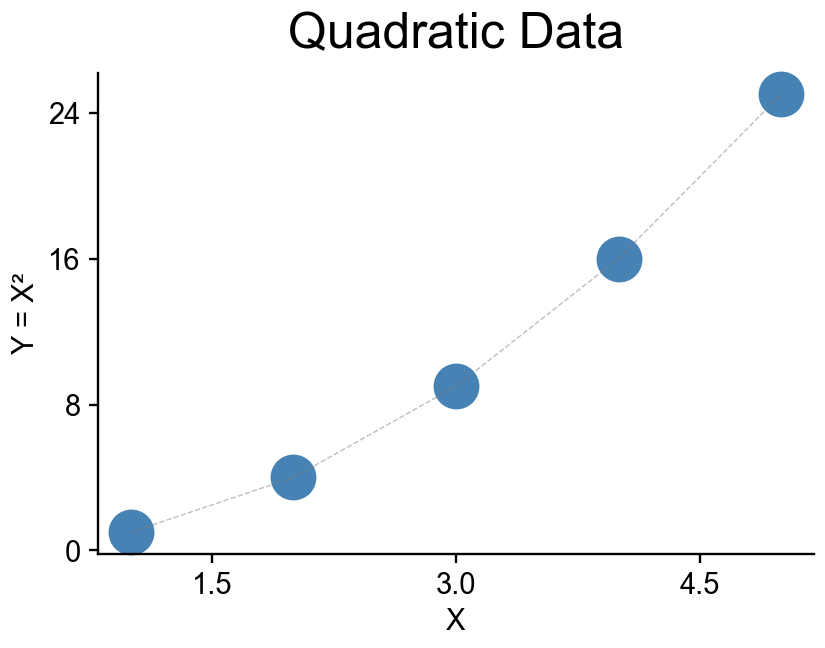

Quick Start
===========

Creating Your First Reproducible Figure
---------------------------------------

FigRecipe wraps matplotlib with automatic recording. Use the standard matplotlib API:

.. code-block:: python

    import figrecipe as fr
    import numpy as np

    # Create figure with recording
    fig, ax = fr.subplots()

    # Use standard matplotlib methods
    x = np.linspace(0, 2 * np.pi, 100)
    ax.plot(x, np.sin(x), label="sin(x)", color="blue", id="sine")
    ax.plot(x, np.cos(x), label="cos(x)", color="red", id="cosine")

    ax.set_xlabel("X (radians)")
    ax.set_ylabel("Y")
    ax.set_title("Trigonometric Functions")
    ax.legend()

    # Save creates: plot.png + plot.yaml
    fr.save(fig, "trig_plot.png")

.. image:: _static/quickstart_trig.png
   :width: 400px
   :align: center
   :alt: Trigonometric plot example

Bundle Format (Recommended for Sharing)
---------------------------------------

For sharing reproducible figures, use the **ZIP bundle format**:

.. code-block:: python

    import figrecipe as fr
    import numpy as np

    fig, ax = fr.subplots()
    x = np.array([1, 2, 3, 4, 5])
    y = x ** 2
    ax.scatter(x, y, id="data")
    ax.set_title("Quadratic Data")

    # Save as self-contained ZIP bundle
    fr.save(fig, "figure.zip")

**Bundle Structure:**

::

    figure.zip
    ├── spec.json         # WHAT to plot (semantic specification)
    ├── style.json        # HOW it looks (colors, fonts, sizes)
    ├── data.csv          # Immutable source data
    └── exports/
        ├── figure.png
        └── figure_hitmap.png

**Load and Reproduce from Bundle:**

.. code-block:: python

    # Load components separately
    spec, style, data = fr.load_bundle("figure.zip")

    # Or reproduce directly
    fig, ax = fr.reproduce_bundle("figure.zip")

Output Files
------------

FigRecipe creates different outputs depending on format:

**PNG/YAML format** (for development):

::

    plot.png               # The figure image
    plot.yaml              # Recipe for reproduction
    plot_data/             # Data CSV files

**ZIP bundle** (for sharing):

::

    plot.zip               # Self-contained bundle with all data

Reproducing a Figure
--------------------

Recreate any figure from its recipe:

.. code-block:: python

    import figrecipe as fr

    # From YAML recipe
    fig, ax = fr.reproduce("trig_plot.yaml")

    # From ZIP bundle
    fig, ax = fr.reproduce_bundle("figure.zip")

    # Optionally modify and save again
    ax.set_title("Modified Title")
    fr.save(fig, "modified.png")

CLI Commands
------------

FigRecipe provides a comprehensive CLI:

.. code-block:: bash

    # Show help
    figrecipe --help

    # Reproduce a figure
    figrecipe reproduce trig_plot.yaml -o reproduced.png

    # Validate reproduction fidelity
    figrecipe validate trig_plot.yaml

    # Compare two images
    figrecipe diff original.png reproduced.png

    # Launch GUI editor
    figrecipe gui trig_plot.yaml

MCP Server for AI Agents
------------------------

FigRecipe includes an MCP server for AI integration:

.. code-block:: bash

    # Start MCP server
    figrecipe mcp start

    # List available MCP tools
    figrecipe mcp list-tools

    # Install to Claude Code
    figrecipe mcp install --claude-code

Statistical Annotations
-----------------------

Add significance brackets:

.. code-block:: python

    import figrecipe as fr

    fig, ax = fr.subplots()
    ax.bar(["Control", "Treatment"], [10, 15], yerr=[1, 1.5])

    # Add significance annotation
    ax.add_stat_annotation(
        x1=0, x2=1,
        p_value=0.01,
        style="stars"  # Shows **
    )

    fr.save(fig, "stats_plot.png")

Multi-Panel Composition
-----------------------

Compose multiple figures:

.. code-block:: python

    import figrecipe as fr

    # Create individual panels
    fig1, ax1 = fr.subplots()
    ax1.plot([1, 2, 3], [1, 4, 9])
    fr.save(fig1, "panel_a.png")

    fig2, ax2 = fr.subplots()
    ax2.bar(["A", "B"], [10, 15])
    fr.save(fig2, "panel_b.png")

    # Compose into multi-panel figure
    fr.compose(
        sources=["panel_a.yaml", "panel_b.yaml"],
        output_path="composed.png",
        layout="horizontal",
        panel_labels=True
    )
