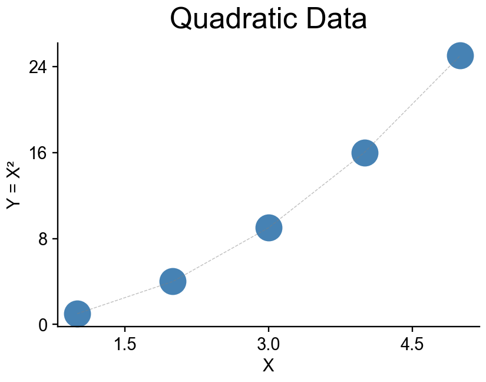

Quick Start
===========

Creating Your First Reproducible Figure
---------------------------------------

FigRecipe wraps matplotlib with automatic recording. Use the standard matplotlib API:

.. code-block:: python

    import figrecipe as fr
    import numpy as np

    # Create figure with recording
    fig, ax = fr.subplots()

    # Use standard matplotlib methods
    x = np.linspace(0, 2 * np.pi, 100)
    ax.plot(x, np.sin(x), label="sin(x)", color="blue", id="sine")
    ax.plot(x, np.cos(x), label="cos(x)", color="red", id="cosine")

    ax.set_xlabel("X (radians)")
    ax.set_ylabel("Y")
    ax.set_title("Trigonometric Functions")
    ax.legend()

    # Save creates: plot.png + plot.yaml
    fr.save(fig, "trig_plot.png")

.. image:: _static/quickstart_trig.png
   :width: 400px
   :align: center
   :alt: Trigonometric plot example

Bundle Format (Recommended for Sharing)
---------------------------------------

For sharing reproducible figures, use the **ZIP bundle format**:

.. code-block:: python

    import figrecipe as fr
    import numpy as np

    fig, ax = fr.subplots()
    x = np.array([1, 2, 3, 4, 5])
    y = x ** 2
    ax.scatter(x, y, id="data")
    ax.set_title("Quadratic Data")

    # Save as self-contained ZIP bundle
    fr.save(fig, "figure.zip")

**Bundle Structure:**

::

    figure.zip
    ├── spec.json         # WHAT to plot (semantic specification)
    ├── style.json        # HOW it looks (colors, fonts, sizes)
    ├── data.csv          # Immutable source data
    └── exports/
        ├── figure.png
        └── figure_hitmap.png

**Load and Reproduce from Bundle:**

.. code-block:: python

    # Load components separately
    spec, style, data = fr.load_bundle("figure.zip")

    # Or reproduce directly
    fig, ax = fr.reproduce_bundle("figure.zip")

Saving Figures
--------------

All three save methods are equivalent for RecordingFigures:

.. code-block:: python

    # These produce identical output (same DPI, crop, recipe):
    fr.save(fig, "plot.png")       # Explicit API
    fig.savefig("plot.png")        # Delegates to fr.save()

    # In a @stx.session context:
    stx.io.save(fig, "plot.png")   # SciTeX universal I/O

Use whichever style you prefer — they all go through the same pipeline
with style-based DPI, auto-crop, and recipe generation.

.. warning::

    Never bypass the wrapper with ``fig.fig.savefig()`` — that accesses
    the raw matplotlib figure and skips DPI, crop, and recipe logic.

Output Files
------------

FigRecipe creates different outputs depending on format:

**PNG/YAML format** (for development):

::

    plot.png               # The figure image
    plot.yaml              # Recipe for reproduction
    plot_data/             # Data CSV files

**ZIP bundle** (for sharing):

::

    plot.zip               # Self-contained bundle with all data

Reproducing a Figure
--------------------

Recreate any figure from its recipe:

.. code-block:: python

    import figrecipe as fr

    # From YAML recipe
    fig, ax = fr.reproduce("trig_plot.yaml")

    # Save reproduced figure (pixel-identical to original)
    fr.save(fig, "reproduced.png")

    # From ZIP bundle
    fig, ax = fr.reproduce_bundle("figure.zip")

    # Optionally modify and save again
    ax.set_title("Modified Title")
    fr.save(fig, "modified.png")

CLI Commands
------------

FigRecipe provides a comprehensive CLI:

.. code-block:: bash

    # Show help
    figrecipe --help

    # Reproduce a figure
    figrecipe reproduce trig_plot.yaml -o reproduced.png

    # Validate reproduction fidelity
    figrecipe validate trig_plot.yaml

    # Compare two images
    figrecipe diff original.png reproduced.png

    # Launch GUI editor
    figrecipe gui trig_plot.yaml

MCP Server for AI Agents
------------------------

FigRecipe includes an MCP server for AI integration:

.. code-block:: bash

    # Start MCP server
    figrecipe mcp start

    # List available MCP tools
    figrecipe mcp list-tools

    # Install to Claude Code
    figrecipe mcp install --claude-code

Statistical Annotations
-----------------------

Add significance brackets:

.. code-block:: python

    import figrecipe as fr

    fig, ax = fr.subplots()
    ax.bar(["Control", "Treatment"], [10, 15], yerr=[1, 1.5])

    # Add significance annotation
    ax.add_stat_annotation(
        x1=0, x2=1,
        p_value=0.01,
        style="stars"  # Shows **
    )

    fr.save(fig, "stats_plot.png")

Multi-Panel Composition
-----------------------

Compose multiple figures:

.. code-block:: python

    import figrecipe as fr

    # Create individual panels
    fig1, ax1 = fr.subplots()
    ax1.plot([1, 2, 3], [1, 4, 9])
    fr.save(fig1, "panel_a.png")

    fig2, ax2 = fr.subplots()
    ax2.bar(["A", "B"], [10, 15])
    fr.save(fig2, "panel_b.png")

    # Compose into multi-panel figure
    fr.compose(
        sources=["panel_a.yaml", "panel_b.yaml"],
        output_path="composed.png",
        layout="horizontal",
        panel_labels=True
    )

Box-and-Arrow Diagrams
-----------------------

Create publication-quality diagrams with mm-based coordinates. Use ``gap_mm`` for automatic flex layout:

.. code-block:: python

    from figrecipe._diagram import Diagram

    d = Diagram(title="EEG Pipeline", gap_mm=10)
    d.add_box("raw", "Raw EEG", subtitle="64 ch", shape="cylinder")
    d.add_box("filter", "Bandpass", subtitle="0.5-45 Hz", emphasis="primary")
    d.add_box("ica", "ICA", subtitle="Artifact removal", emphasis="primary")
    d.add_arrow("raw", "filter")
    d.add_arrow("filter", "ica")

    d.save("pipeline.png")  # auto-crops, generates recipe + hitmap + debug image

.. image:: _static/quickstart_diagram_lr.png
   :width: 100%
   :align: center
   :alt: Left-to-right diagram pipeline

Containers group boxes with automatic layout:

.. code-block:: python

    d = Diagram(title="System", gap_mm=10)
    d.add_box("a", "Module A", emphasis="primary")
    d.add_box("b", "Module B", emphasis="primary")
    d.add_container("core", title="Core", children=["a", "b"], direction="row")
    d.add_box("out", "Output", shape="document", emphasis="muted")
    d.add_arrow("core", "out")
    d.save("system.png")

Auto-Fix & Save Options
^^^^^^^^^^^^^^^^^^^^^^^^

``auto_fix=True`` resolves layout violations automatically:

.. code-block:: python

    fig, ax = d.render(auto_fix=True)

    # d.save() is the primary API — renders, auto-crops, and saves all artifacts:
    d.save("out.png", watermark=True)  # stamps "Plotted by FigRecipe"

Output files from ``d.save()``:

- ``out.png`` — Auto-cropped diagram
- ``out.yaml`` — Recipe for reproduction
- ``out_hitmap.png`` — Click-target regions for GUI editing
- ``out_debug.png`` — Debug overlay with positions and anchors

Shapes & Anchors
^^^^^^^^^^^^^^^^^

**Shapes**: ``rounded`` (default), ``box``, ``stadium``, ``cylinder``, ``document``, ``file``, ``codeblock``.

**Anchors**: ``top``, ``bottom``, ``left``, ``right``, ``top-left``, ``top-right``, ``bottom-left``, ``bottom-right``, ``center``, ``auto``. Aliases (``n``/``s``/``e``/``w``, ``tl``/``br``) are normalized.

Diagram Validation Rules
^^^^^^^^^^^^^^^^^^^^^^^^

All rules are enforced on render. Failed figures are saved with ``_FAILED`` suffix.

.. list-table::
   :header-rows: 1
   :widths: 10 50 20

   * - Rule
     - Check
     - Severity
   * - W
     - Width exceeds 185 mm (double-column max)
     - Warning
   * - R1
     - Container must enclose all children
     - Error
   * - R2
     - No two boxes may overlap
     - Error
   * - R3
     - Container title must clear children (5 mm zone)
     - Warning
   * - R4
     - Box text must fit within padded inner area
     - Warning
   * - R5
     - Text-to-text margin >= 2 mm
     - Error
   * - R6
     - Text-to-edge margin >= 2 mm
     - Error
   * - R7
     - Arrow visible-length ratio >= 90%
     - Error
   * - R8
     - Curved-arrow label on same side as arc
     - Error
   * - R9
     - All elements within canvas bounds
     - Error
