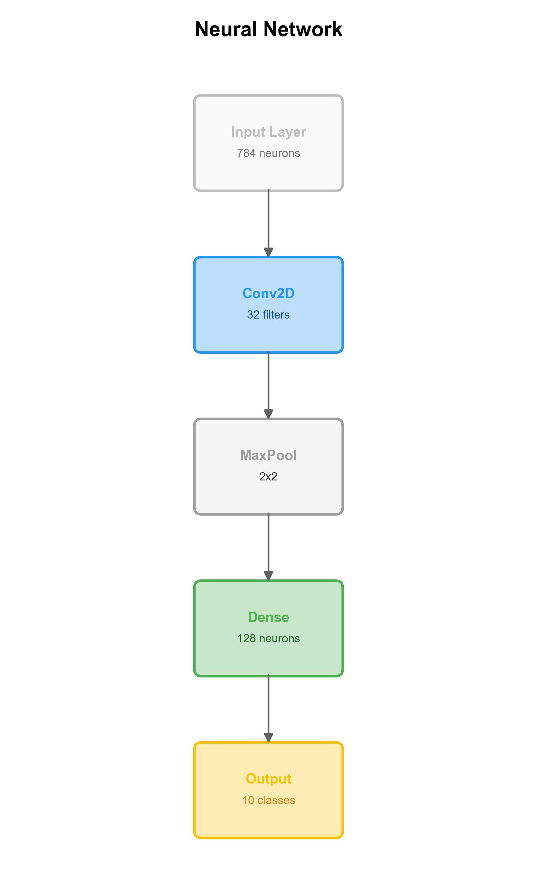

# FigRecipe Examples

Demonstration scripts showcasing FigRecipe's capabilities for reproducible scientific figures.

## Quick Start

```bash
# Run all examples
./00_run_all.sh
```

## Examples

| # | File | Description |
|---|------|-------------|
| 01 | `01_bundle_format.py` | ZIP bundle: save, load, reproduce |
| 02 | `02_plot_and_reproduce_all.py` | All 47 plot types with reproduction validation |
| 03 | `03_composition.py` | Multi-panel composition (grid + freeform mm) |
| 04 | `04_statistical_annotations.py` | Statistical brackets, captions, panel labels |
| 05 | `05_style_anatomy.py` | Annotated SCITEX style parameter reference |
| 06 | `06_style_switching.py` | Style switching (SCITEX vs matplotlib) |
| 07 | `07_csv_workflow.py` | CSV-first data workflow |
| 08 | `08_diagram.py` | Scientific diagrams (Mermaid, Graphviz, YAML) |
| 09 | `09_schematic.py` | Box-and-arrow diagrams (mm-based, see below) |
| 10 | `10_mcp.py` | MCP integration for AI agents |
| 11 | `11_cli_commands.sh` | CLI: info, reproduce, validate, crop, extract |
| 99 | `99_gui_editor.py` | Interactive Flask-based visual editor |

## Diagrams (Example 09)

Left-to-right pipeline:

<p align="center">
  
</p>

Top-to-bottom architecture:

<p align="center">
  
</p>

## Output Directories

Each example creates an `*_out/` directory:
```
examples/
  01_bundle_format_out/
  02_plot_and_reproduce_all_out/
  03_composition_out/
  04_statistical_annotations_out/
  ...
```

## Requirements

- Python 3.10+
- FigRecipe installed: `pip install -e .`
